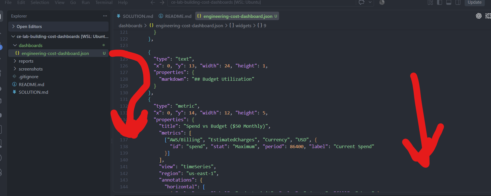
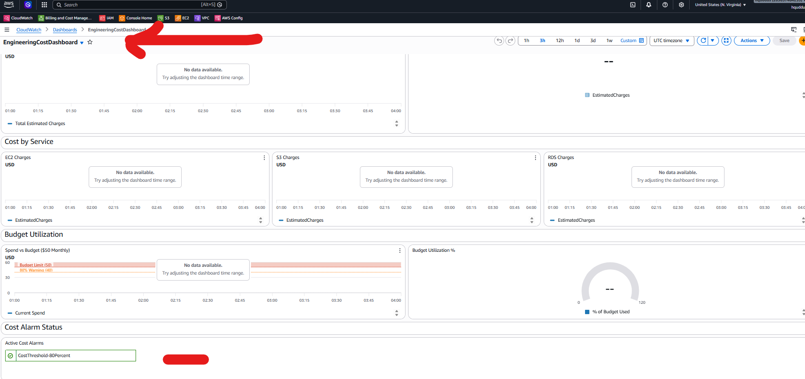
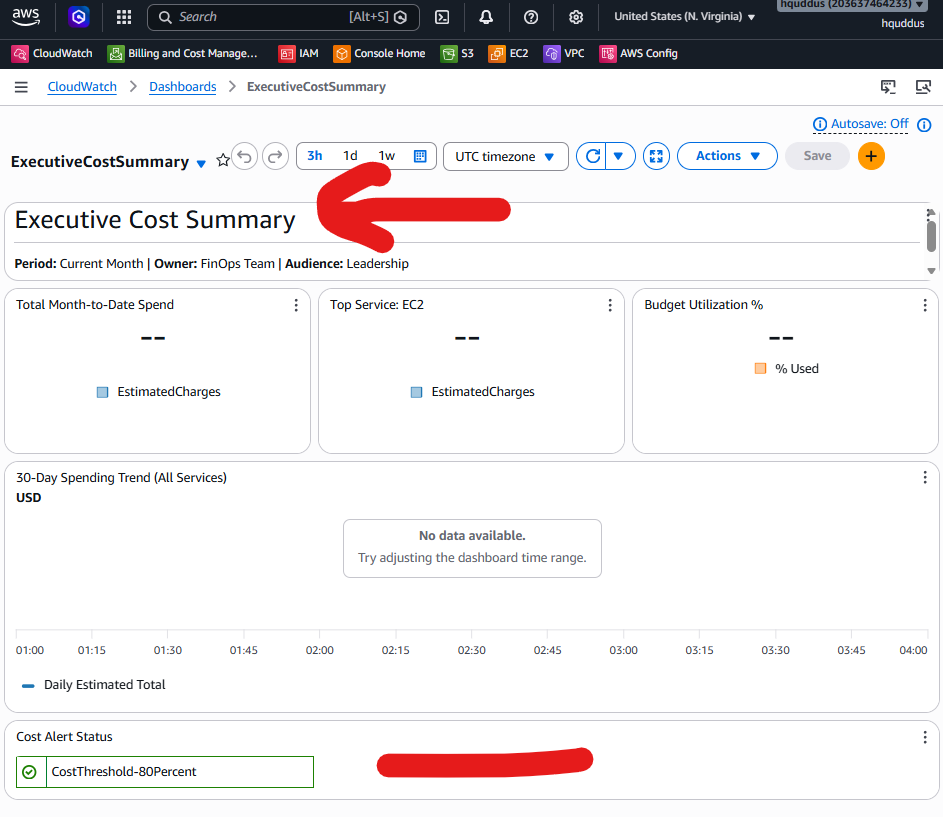

# Lab M7.09 - Building Cost Dashboards - Solution

## Lab Information

**Repository:** ce-lab-building-cost-dashboards\
**Lab:** M7.09 - Building Cost Dashboards\
**Objective:** Build AWS CloudWatch dashboards for FinOps cost
monitoring and executive reporting.

------------------------------------------------------------------------

# 1. Lab Environment Setup

The lab repository was initialized and the required directories were
created:

``` bash
git init
mkdir -p dashboards screenshots reports
```

AWS Billing metrics availability was verified using the AWS CLI:

``` bash
aws cloudwatch list-metrics \
--namespace "AWS/Billing" \
--metric-name "EstimatedCharges" \
--region us-east-1
```

The AWS/Billing namespace was available and the EstimatedCharges metric
was identified.

## Screenshot


------------------------------------------------------------------------

# 2. Engineering Cost Dashboard

A CloudWatch dashboard JSON file was created:

    dashboards/engineering-cost-dashboard.json

The dashboard was designed for engineering teams to monitor:

-   Total estimated monthly charges
-   Current month spending
-   Cost by AWS service
-   Budget utilization
-   Cost alarm status

The dashboard contains four main sections:

1.  Cost overview
2.  Cost by service
3.  Budget utilization
4.  Cost alarm monitoring

------------------------------------------------------------------------

# 3. Monthly Cost Trend Widgets

The dashboard uses AWS Billing metrics:

-   Namespace: AWS/Billing
-   Metric: EstimatedCharges
-   Currency: USD

The following widgets were created:

-   Monthly Estimated Charges (Total)
-   Current Month Spend

Configuration example:

``` json
"AWS/Billing",
"EstimatedCharges",
"Currency",
"USD"
```

## Screenshot


------------------------------------------------------------------------

# 4. Per-Service Cost Breakdown

Service-level widgets were added using the ServiceName dimension.

Configured services:

-   AmazonEC2
-   AmazonS3
-   AmazonRDS

These widgets allow engineers to identify major cost contributors.

## Screenshot


------------------------------------------------------------------------

# 5. Budget Utilization Widget

Budget monitoring was implemented using:

-   Current Estimated Charges
-   Monthly budget threshold
-   Percentage utilization gauge

Configured budget:

    Monthly Budget: $50
    Warning Threshold: $40 (80%)

The dashboard includes:

-   Spend vs Budget graph
-   Budget utilization percentage gauge

## Screenshot



------------------------------------------------------------------------

# 6. Cost Alarm Status

Existing CloudWatch cost alarms were connected to the dashboard.

The configured alarm ARN:

    arn:aws:cloudwatch:us-east-1:203637464233:alarm:CostThreshold-80Percent

The alarm widget provides a single view of active cost alerts.

## Screenshot


CLI verification:

``` bash
aws cloudwatch describe-alarms \
--alarm-name-prefix "Cost"
```

Output confirmed:

    CostThreshold-80Percent

## Deployment

The Engineering dashboard was deployed:

``` bash
aws cloudwatch put-dashboard \
--dashboard-name EngineeringCostDashboard \
--dashboard-body file://dashboards/engineering-cost-dashboard.json \
--region us-east-1
```

Validation result:

``` json
{
    "DashboardValidationMessages": []
}
```

## Screenshot


------------------------------------------------------------------------

# 7. Engineering Dashboard Result

The completed Engineering Cost Dashboard is available in Amazon
CloudWatch.

Dashboard:

    EngineeringCostDashboard

It contains:

-   Monthly estimated charges
-   Current month spend
-   Service cost breakdown
-   Budget utilization
-   Cost alarm status

## Screenshot



------------------------------------------------------------------------

# 8. Executive Summary Dashboard

A second dashboard was created for leadership reporting:

    ExecutiveCostSummary

The dashboard provides:

-   Month-to-date spend
-   Top cost service
-   Budget utilization
-   30-day spending trend
-   Cost alert status

The alarm widget was configured with:

    CostThreshold-80Percent

## Deployment

``` bash
aws cloudwatch put-dashboard \
--dashboard-name ExecutiveCostSummary \
--dashboard-body file://dashboards/executive-summary-dashboard.json \
--region us-east-1
```

Validation result:

``` json
{
    "DashboardValidationMessages": []
}
```

## Screenshot


------------------------------------------------------------------------

# 9. Executive Dashboard Result

The final executive dashboard provides a simplified cost overview
suitable for stakeholders.

Dashboard:

    ExecutiveCostSummary

## Screenshot



------------------------------------------------------------------------

# 10. Key Learnings

Through this lab the following AWS FinOps practices were implemented:

-   Cloud cost visualization using CloudWatch dashboards
-   AWS Billing metric monitoring
-   Service-level cost analysis
-   Budget tracking and utilization monitoring
-   CloudWatch alarm integration
-   Executive cost reporting dashboards
-   Programmatic dashboard deployment using AWS CLI

------------------------------------------------------------------------

# 11. Success Criteria

  Requirement                         Status
  ----------------------------------- -----------
  Engineering dashboard created       Completed
  Minimum 6 widgets across sections   Completed
  Service-level cost monitoring       Completed
  Budget utilization view             Completed
  Alarm status widget                 Completed
  Executive dashboard created         Completed
  CloudWatch deployment through CLI   Completed
  Weekly reporting template created   Completed
